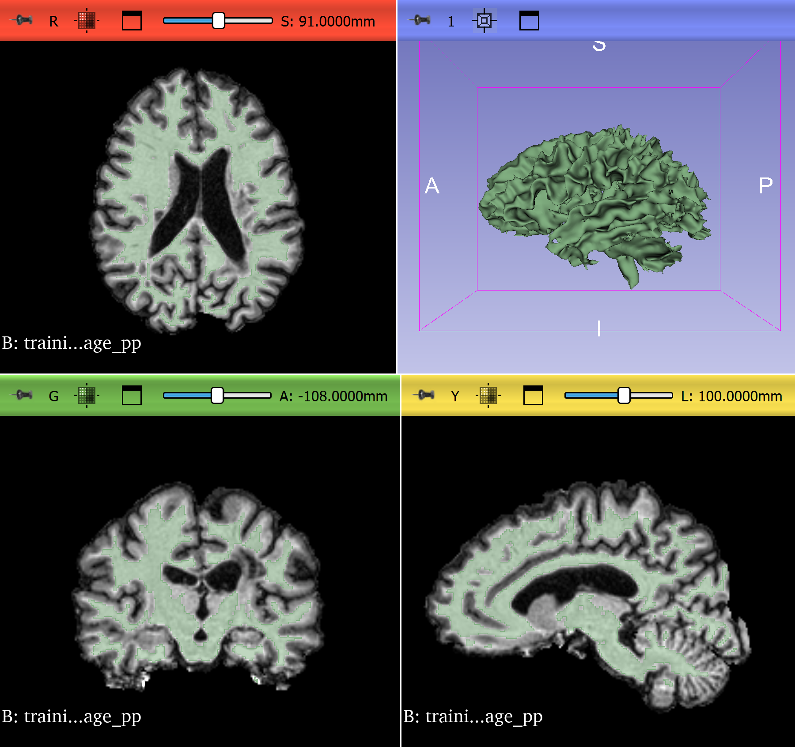
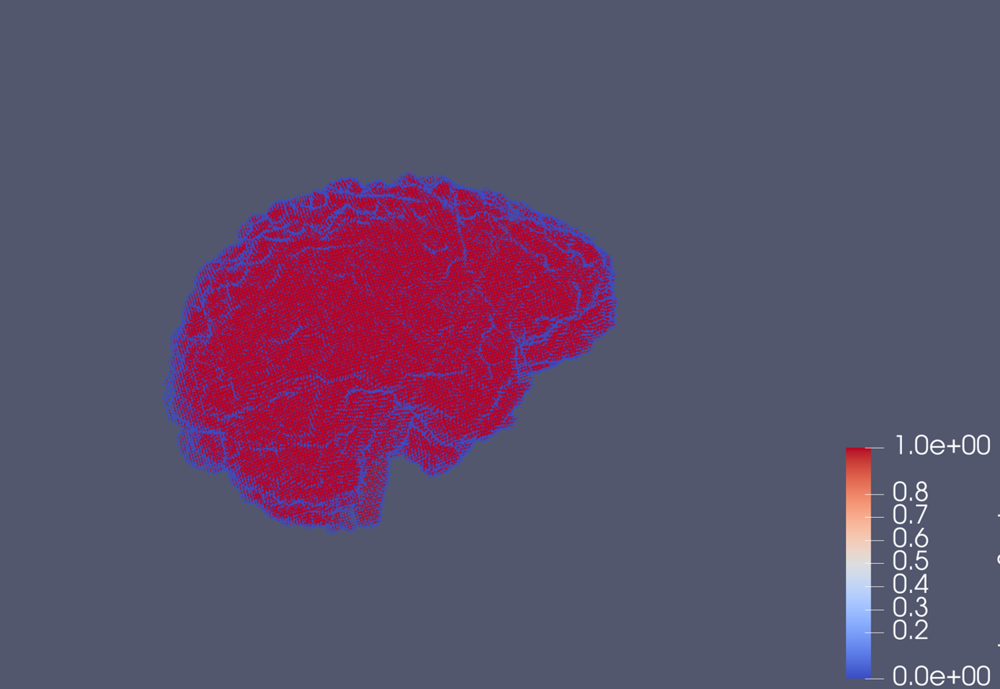
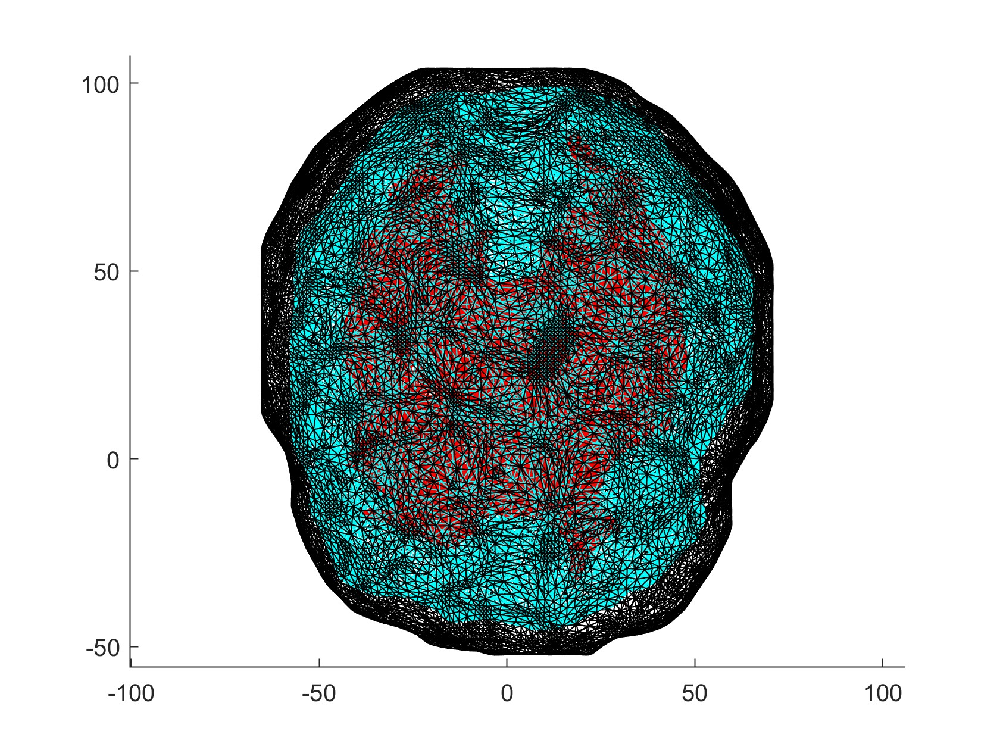
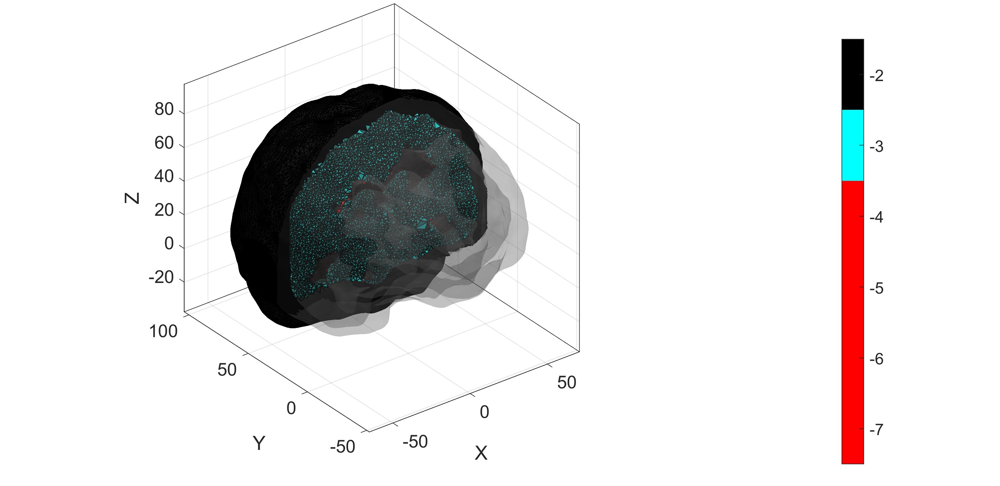
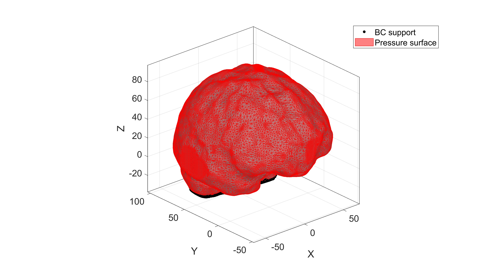
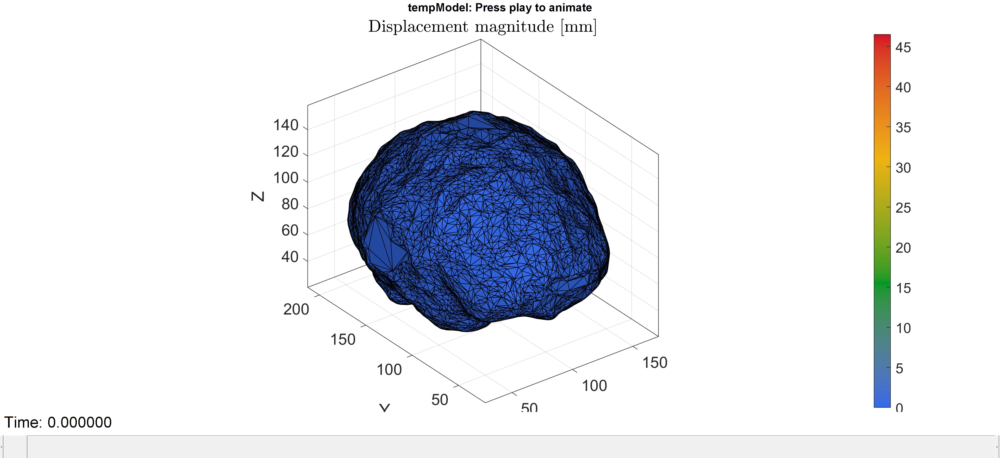
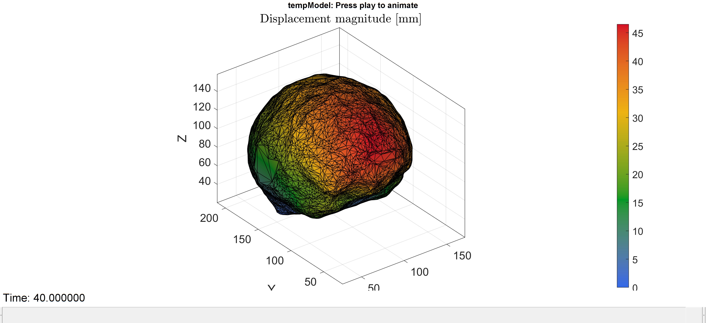

# MSMRIBrain-FE-PipelineV1
This a computational pipeline through which pointclouds extracted from patient-specific MRI of MS patients (using a 3D Slicer and ParaView) and their respective lesion segmentations can be converted in an FE-model so that mechanical tissue properties can be extracted and analysed. The repository contains three scripts. The full PointcloudToModelFullPipeline script requires the .ply files contained in the zipped folder to run the complete point cloud–to–mesh conversion. The remaining two scripts accept a pre-meshed brain ready for finite element analysis (FEA) in the form of .mat files. Details of analysis using and implementation of this pipeline can be found in the cited publication [1].
## Requirements

MATLAB 2023b, FEBioStudio (studio version 2.4, solver version 4.4) and GIBBON are all required for simulations to run. Installation instructions can be found at the following address: https://www.gibboncode.org/Installation/.  
<p align="center">
  
  
  
</p>

## Manual Preprocessing Step For Brain MRI Scans 
This pipeline requires manual thresholding of white matter MRI scans achieved by a simple thresholding operation (Figure 1a), the same process is applied for grey matter (using the whole brain) and the lesions (using accompanying segmentation masks). These images are saved as NRRD files and imported into ParaView to produce the pointcloud outputs (.ply files). A future aim is to automate these processes and integrate them into the automated pipeline. This process is straightforward and must be performed if the user wishes to analyse a brain MRI scan of their choosing as opposed to using the sample input data. Sample .ply files are provided in the zip file however, meaning the step covered in this section is not necessary to demonstrate the model (PointcloudToModelFullPipeline.m).

<p align="center">
  
  
</p>
<p align="center">
  <em>Figure 1: a) LHS shows thresholding process using Slicer b) RHS depicts pointcloud result conversion result using Paraview ready for input into the pipeline (see plyFiles.zip for the pipeline).</em>
</p>

## The Pipeline
Three pointcloud inputs feed into the pipeline (PointcloudToModelFullPipeline.m), corresponding to grey matter, white matter and lesional tissues, and each of them into surface mesh (and in the case of the lesions, meshes) (Figure 2). These can then be combined, exploiting positional consistency between the pointclouds. To access examples, please unzip plyFiles.zip and place them in the same directory as the PointcloudToModelFullPipeline.m script.
<p align="center">
  
</p>
<p align="center">
  <em>Figure 2: Combined brain surface meshes: grey matter is depicted in black, white matter in aqua and lesions in red. </em>
</p>
The "Tetgen" function, native to GIBBON, is then used to convert the surface mesh into a volumetric tetrahedral mesh using Delaunay tetrahedralisation, by taking the boundary geometry and filling the interior of each of the composite regions with tetrahedral elements (Figure 3). 
<p align="center">
  
</p>
<p align="center">
  <em>Figure 3: The 3D mesh post-application of 'tetgen', using the same colour scheme as above. </em>
</p>

During the study, we sped up our process by saving the 3D meshes as .mat files (see file tree). The meshDataQ0.mat, meshDataQ1.mat and meshDataQ2.mat are produced using the same brain MRI scan but with the 'targetfaces' parameter altered in the 'FullPipeline scripts' to adjust the number of tetrahedrons comprising each of the sub-regions. The Q0 file contains the coarsest mesh, while the Q2 is the finest included in this repository due to GitHub upload constraints. Using the full pipeline, finer meshes can be produced but will be more computationally expensive to run at the FEBio stage, see Table 5 in Appendix B of the corresponding publication for parametric inputs to produce these [1]. The information from this section onwards also applies to the CyclicLoading and LinearSetup MATLAB scripts in the file tree.

<p align="center">
  
</p>
<p align="center">
  <em>Figure 4: Application of boundary conditions, defined at the base of the brain (shown in black), where the brainstem connects. </em>
</p>

Tissue properties, loading/pressure parameters and boundary conditions can then be applied. The Ogden hyperelastic model is used as default. The tissue properties for each of the constituent tissues are based on those reported in literature as well as the Prony series for cyclic loading (see referenced study) [1]. Loading is applied tangentially to every external face of the mesh and a set of fixed points are defined at the base of the brain as the boundary condition (Figure 4). All these parametric inputs can be adjusted or changed depending on user requirements. 

<p align="center">
  
  
</p>
<p align="center">
  <em>Figure 5: a) Top: Displacement heatmap pre-application of loading using FEBio. b) Bottom: Displacement heatmap post-application of loading using FEBio.</em>
</p>
Once the model setup is complete, the 3D mesh is passed to FEBio, allowing the extraction of mechanical properties including stress, volumetric strain, and displacement. The pipeline outputs a 3D heatmap based on changes in displacement (Figure 5) and pressure distribution across the brain model. Plots of these changes over time are also produced.
 


## References

If you use this work, please cite:

[1] Szekely-Kohn AC, De Oliveira DC, Castellani M, Douglas M, Ahmed Z, Espino DM.  
*A semi-automated modelling pipeline to predict the mechanics of multiple sclerosis lesion afflicted brains from magnetic resonance images.*  
Computers in Biology and Medicine, 204:111519, 2026.

```bibtex
@article{szekely2026semi,
  title={A semi-automated modelling pipeline to predict the mechanics of multiple sclerosis lesion afflicted brains from magnetic resonance images},
  author={Szekely-Kohn, Adam C and De Oliveira, Diana Cruz and Castellani, Marco and Douglas, Michael and Ahmed, Zubair and Espino, Daniel M},
  journal={Computers in Biology and Medicine},
  volume={204},
  pages={111519},
  year={2026},
  publisher={Elsevier}
}

